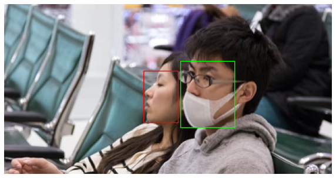

# Detecting facemasks in images with Faster R-CNN in Pytorch.

An important concept to understand for this project is **Transfer Learning**. 
>  Transfer learning is a machine learning method where we reuse a pre-trained model as the starting point for a model on a new task. To put it simply—a model trained on one task is repurposed on a second, related task as an optimization that allows rapid progress when modeling the second task.
### What is Faster R-CNN?
Faster R-CNN is a deep convolutional network used for object detection, that appears to the user as a single, end-to-end, unified network. The network can accurately and quickly predict the locations of different objects.

The region-based CNN (R-CNN), which is the first trial towards building an object detection model that extracts features using a pre-trained CNN. Next, Fast R-CNN is quickly reviewed, which is faster than the R-CNN but unfortunately neglects how the region proposals are generated. This is later solved by the Faster R-CNN, which builds a region-proposal network that can generate region proposals that are fed to the detection model (Fast R-CNN) to inspect for objects. 

